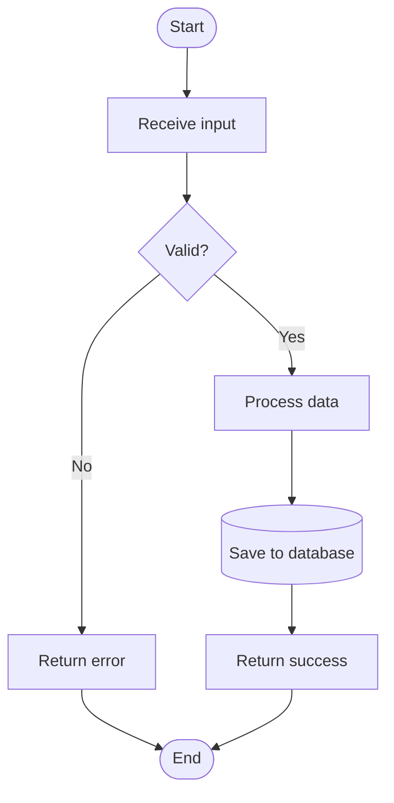

# Prompt Writing Guidelines

This document specifies the rules for creating prompts.

## Core Requirements

### 1. Clarity and Conciseness

Prompts MUST be clear and concise.

### 2. Requirement Specification Language

Prompts MUST use RFC 2119 keywords to indicate requirement levels:

- **MUST** / **REQUIRED** / **SHALL**: Absolute requirement
- **MUST NOT** / **SHALL NOT**: Absolute prohibition
- **SHOULD** / **RECOMMENDED**: Strong recommendation, exceptions MAY exist
- **SHOULD NOT** / **NOT RECOMMENDED**: Strong discouragement, exceptions MAY exist
- **MAY** / **OPTIONAL**: Truly optional behavior

**Example:**

```
The system MUST validate all input parameters.
The system SHOULD log operations for debugging.
The system MAY cache results for performance.
```

### 3. Process Flow Diagrams

Prompts MUST use Mermaid flowcharts to showcase steps that need to execute in sequence.

**Example:**


## Mermaid Flowchart Syntax

### Basic Elements


### Connections


### Example: Multi-step Process



---

<!-- Ignore section if arguments are not replaced -->
<userinput>
$ARGUMENTS
</userinput>
