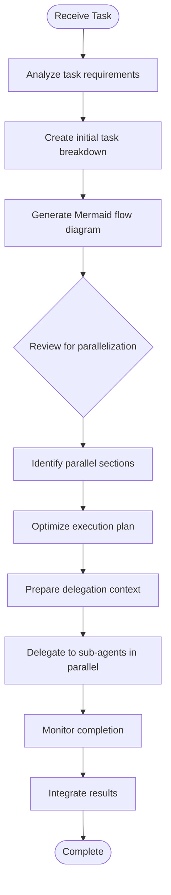

# Parallel Execution Mode

This command instructs the AI agent to optimize task execution by identifying and running parallelizable tasks concurrently using sub-agents.

## Core Objective

When this command is invoked, you MUST analyze the user's request, identify tasks that can be executed in parallel, and delegate them to sub-agents for concurrent execution to minimize total execution time.

## Execution Process



## Requirements

### 1. Task Planning

You MUST:

- Break down the user's request into discrete, actionable tasks
- Create a Mermaid flowchart showing task dependencies
- Clearly identify sequential vs. parallel execution paths

### 2. Optimization Review

You MUST:

- Review the initial plan for parallelization opportunities
- Identify tasks with no interdependencies that can run concurrently
- Optimize the execution order to minimize total time
- Explicitly state which tasks will be executed in parallel

### 3. Parallel Delegation

You MUST:

- Delegate independent tasks to sub-agents using the Task tool
- Execute ALL parallel tasks in a SINGLE message with multiple Task tool calls
- NOT execute parallelizable tasks sequentially yourself

## Delegation Guidelines

When delegating tasks to sub-agents, you MUST provide comprehensive context to ensure successful execution.

### Required Context Elements

Each delegation MUST include:

#### 1. High-Level Objective

Provide the overarching goal that spans all agents.

**Example:**

```
High-Level Objective: Implement a user authentication system with email verification
```

#### 2. Sub-Agent Role and Expectations

Clearly define:

- The specific role of this sub-agent in the broader context
- What the sub-agent is responsible for
- Expected return values and format
- Success criteria

**Example:**

```
Your Role: Create the email verification service module
Return Expected: A complete implementation of the EmailVerificationService class with methods for sending verification codes and validating tokens
Success Criteria: The service must integrate with the existing User model and handle error cases gracefully
```

#### 3. Key Information and Side Effects

You MUST specify:

- File names and paths where work should be done
- Function/class/variable names to use
- Data structures and interfaces to implement
- Integration points with existing code
- Expected side effects (e.g., files created, dependencies added)

**Example:**

```
Implementation Details:
- Create file: src/services/EmailVerificationService.ts
- Implement class: EmailVerificationService
- Methods required: sendVerificationEmail(userId: string), verifyToken(token: string)
- Must import and use: User model from src/models/User.ts
- Side effects: Will create new email template files in src/templates/
```

### Anti-Patterns to Avoid

You MUST NOT:

- Assume sub-agents have your current context
- Use ambiguous instructions like "implement the feature"
- Omit file paths or specific names
- Delegate without stating success criteria
- Forget to specify integration requirements

### Delegation Quality Checklist

Before delegating, verify each task includes:

- ✓ High-level objective statement
- ✓ Specific role and responsibilities
- ✓ Expected return values and format
- ✓ File paths and names
- ✓ Function/class/variable names
- ✓ Integration points
- ✓ Success criteria

## Example: Parallel Execution

**User Request:** "Create a REST API with user authentication, product catalog, and order management"

**Step 1: Task Planning**


**Step 2: Optimization Review**

Parallel execution opportunities identified:

- Authentication, Product Catalog, and Order Management modules can be built concurrently
- They have no interdependencies and share only the base architecture

**Step 3: Parallel Delegation**

Execute three sub-agents in parallel:

**Agent 1 - Authentication:**

```
High-Level Objective: Build a REST API with user authentication, product catalog, and order management

Your Role: Implement the user authentication module
- Create authentication routes and controllers
- Implement JWT token generation and validation
- Add password hashing with bcrypt

Expected Return: Complete implementation status with file paths created

Implementation Details:
- Create files in: src/modules/auth/
- Routes file: src/modules/auth/auth.routes.ts
- Controller: src/modules/auth/auth.controller.ts
- Service: src/modules/auth/auth.service.ts
- Endpoints: POST /auth/register, POST /auth/login, GET /auth/verify
- Must export: authRouter for integration in main app.ts

Success Criteria: Authentication endpoints functional with proper error handling
```

**Agent 2 & 3:** Similar comprehensive context for Products and Orders

All three agents are launched in a SINGLE message using multiple Task tool calls.

## Success Indicators

Successful parallel execution MUST demonstrate:

- Clear identification of parallelizable tasks
- Single message with multiple concurrent Task tool calls
- Comprehensive delegation context for each sub-agent
- Reduced total execution time compared to sequential execution
- Successful integration of parallel results

---

<!-- Ignore section if arguments are not replaced -->
<userinput>
$ARGUMENTS
</userinput>
